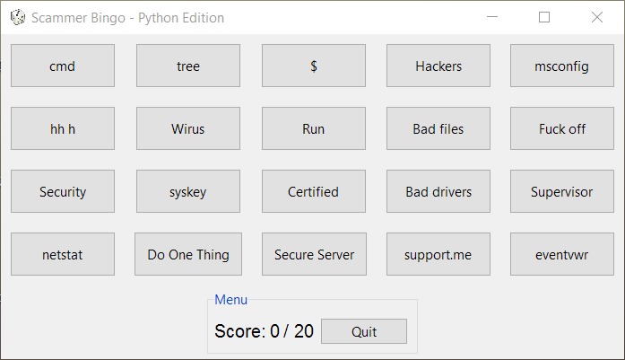

# [Scammer Bingo Reborn Python Edition](https://github.com/margobra8/scammer-bingo-reborn-python/releases)

This is the Python Community Edition of **Jim Browning' Scammer Bingo**

----------

Information
-------------

> **Current build status:**

> - *16 August 2016.*
>   - The main GUI widget has been finished and callback enhancement has been performed.
>   - Launcher added (to be removed when installation wizard is created).

Installation
------------

SBR-Python is compatible with the following environments:

- Any OS that runs **`Python 3.5`**:

 1. Install the following module/s: 
[Pygubu](https://github.com/alejandroautalan/pygubu)  
`$ pip install pygubu`

 2. Navigate to the cloned/downloaded main directory:  
`$ cd Scammer-Bingo-Reborn-Python`

 3. Run the start bat launcher  
`$ start.bat`

- ~~Windows XP/Vista/7/8+/10:~~
	 - TBD on release v1.0

Future improvements
-----------

 - GUI styling
 - Button editor
 - Installation wizard

Other versions
-----------

- [C#](https://github.com/JoeTheHuman/Scammer-Bingo-Reborn)
- [Android](https://play.google.com/store/apps/details?id=com.xelitexirish.scammerbingo)
- [Java (Universal)](https://github.com/HexxiumCreations/spammer-bingo-desktop-java)
